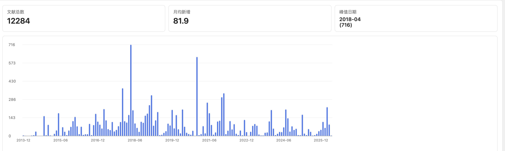
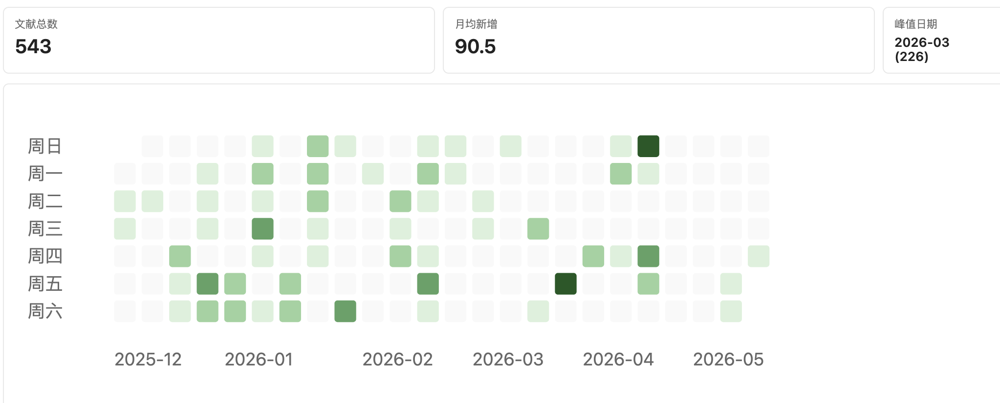
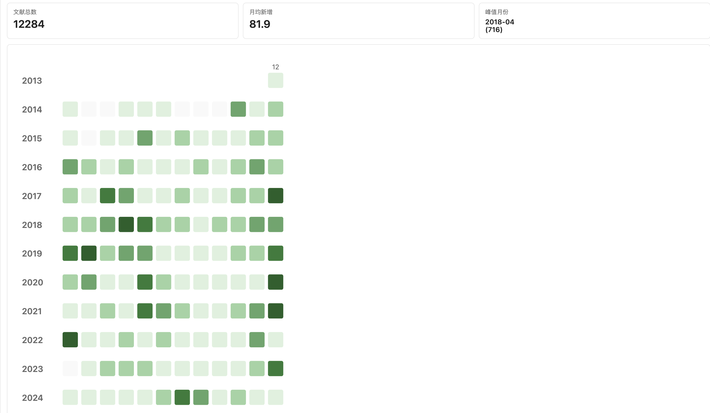

# Reference Additions Stats / 文献添加统计 (Zotero 7/8/9)

一个适配 Zotero 7、8、9 的示例插件，用于在 Zotero 独立标签页中查看“新增文献数量”统计看板，并提供集合过滤、视图与时间范围筛选。

## 效果图

## 功能

- 按月聚合新增文献（基于 `dateAdded`）
- 通过 `Tools -> Reference Additions Stats`（英文环境）或 `工具 -> 文献添加统计`（中文环境）打开独立 Zotero 统计标签页
- 按集合过滤（支持“全部集合”以及选中集合的子集合汇总）
- 两种图表视图：柱状图、打卡热力图（按天/按月，日级 `30+` 固定最深绿色）
- 时间段筛选：热力图支持近 6 个月、近一年、近三年、全部；柱状图支持近一年、近三年、全部
- 汇总指标：区间总数、月均值、峰值日期/月份
- 中英文界面自动跟随 Zotero 语言设置（中文环境显示中文，其余语言默认英文）

## 安装（开发测试）

1. 将当前目录打包为 `.xpi`（本质上是 zip）
2. Zotero -> Tools -> Plugins -> 齿轮 -> Install Add-on From File...
3. 重启 Zotero（若未自动生效）

## 使用

- 打开 Zotero 主窗口
- 进入 `Tools` 菜单
- 点击 `Reference Additions Stats`（英文环境）或 `文献添加统计`（中文环境）

Zotero 会打开一个独立的 `文献添加统计` 标签页。再次点击菜单会聚焦已有统计页并刷新数据，不会替换左侧集合树。

## 文件说明

- `manifest.json`: Zotero 7/8/9 插件清单
- `bootstrap.js`: 生命周期、菜单注入、数据统计与图表渲染
- `locale/`: Fluent 本地化资源（`zh-CN`、`en-US`）
- `prefs.js`: 默认配置（默认时间段和默认视图）
